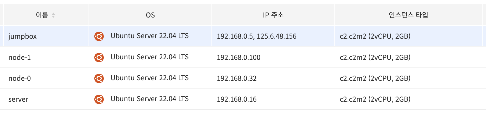

### 개요

이 실습에서는 Kubernetes 클러스터를 구성하기 위해 필요한 컴퓨팅 리소스를 설정합니다. 일반적으로 다음을 준비합니다:

- **Kubernetes 컨트롤 플레인**을 구동할 머신(여기서는 `server`라고 명명)
- 컨테이너 워크로드를 실행하는 **워커 노드**(여기서는 `node-0`, `node-1`)

이러한 머신들이 서로 통신할 수 있도록 SSH 접근, 호스트네임 설정, DNS(또는 `/etc/hosts`) 구성이 필요합니다.

> **참고:** 이 튜토리얼은 편의를 위해 `root` 사용자 SSH 접근을 활성화합니다. 실제 운영 환경에서는 일반 사용자 계정을 사용하고 보안 설정을 강화하는 것을 권장합니다.

### 사전 준비




- 모든 노드에 접근 가능한 **jumpbox** 머신
- `server`, `node-0`, `node-1`로 구성된 총 3대의 머신
- SSH 키(비밀번호 대신 키를 통한 인증 권장)
- 각 머신에 대한 루트 권한(혹은 이에 준하는 권한)

---

### 1. 머신 데이터베이스 생성

`machines.txt` 파일을 만들어서 클러스터에 속한 각 머신 정보를 간단히 정리합니다. 일반적인 형식은 다음과 같습니다:

```text
IPV4_ADDRESS FQDN HOSTNAME POD_SUBNET
```

- `IPV4_ADDRESS`: jumpbox에서 접근 가능한 IP 주소
- `FQDN`: 머신의 FQDN 도메인 이름
- `HOSTNAME`: 짧은 호스트명(`server`, `node-0`, `node-1` 등)
- `POD_SUBNET` (선택): Calico 등의 CNI를 직접 설정할 때 사용되는 노드별 Pod CIDR 범위

단, **Calico**와 같은 네트워킹 솔루션을 사용할 경우, 노드별 고유한 Pod 서브넷이 불필요할 수 있으므로 이 칼럼을 생략해도 됩니다.

<details>
<summary>예시 <code>machines.txt</code> 파일</summary>

```bash
cat <<EOF > machines.txt
192.168.0.16   server.kubernetes.local     server
192.168.0.32   node-0.kubernetes.local     node-0   10.200.0.0/24
192.168.0.100  node-1.kubernetes.local     node-1   10.200.1.0/24
EOF
```

</details>

작성한 `machines.txt` 파일의 IP 주소, 호스트명을 실제 환경에 맞게 조정합니다.

---

### 2. SSH 접근 구성

#### 2.1 `root` SSH 접근 확인/활성화

이 튜토리얼에서는 편의를 위해 `root` 사용자 SSH 접근을 사용합니다. 보안상 이유로 많은 클라우드 제공사는 `root` 로그인을 기본적으로 차단합니다. 만약 이미 `root`로 접속할 수 있다면 이 단계를 건너뛰세요.

1. 각 노드(예: `server`, `node-0`, `node-1`)에 `ubuntu` 등 일반 사용자로 접속
2. `sudo su -` 명령어로 `root` 계정 전환
3. `/etc/ssh/sshd_config` 파일에서 `PermitRootLogin yes`로 설정
4. SSH 데몬 재시작: `systemctl restart sshd`

<details>
<summary>root SSH 예시 설정</summary>

```bash
sudo su -
sed -i 's/^PermitRootLogin.*/PermitRootLogin yes/' /etc/ssh/sshd_config
systemctl restart sshd
```
</details>

#### 2.2 SSH 키 생성 및 배포

작업 편의를 위해 튜토리얼 전용 SSH 키를 생성하고, 각 노드에 배포합니다:

1. **키 생성** (jumpbox에서 실행):

   ```bash
   ssh-keygen
   ```
    - `/root/.ssh/id_rsa`에 저장(기본값)
    - 패스프레이즈는 비워두어도 됩니다.

2. **공개 키 배포**:
    - 기존에 다른 SSH 키로 접속이 가능하다면, 해당 키로 노드에 접속한 뒤 새롭게 생성한 `id_rsa.pub` 내용을 `~/.ssh/authorized_keys`에 추가합니다.

3. **새 키 접속 확인**:

   ```bash
   while read IP FQDN HOST; do
     ssh -i /root/.ssh/id_rsa root@"${IP}" uname -o -m -n
   done < machines.txt
   ```
   정상적으로 연결되면 각 노드의 OS, 아키텍처, 호스트명이 출력됩니다.

---

### 3. 호스트네임 설정

클러스터의 각 머신은 `server`, `node-0`, `node-1` 같은 호스트네임과 FQDN을 가져야 합니다. 이를 통해 Kubernetes 컴포넌트 간 통신 시 IP 주소 대신 호스트명을 사용할 수 있습니다.

**jumpbox**에서 다음 스크립트를 실행하세요:

```bash
while read IP FQDN HOST SUBNET; do
  # 각 노드의 /etc/hosts에서 127.0.1.1 라인을 FQDN/HOST로 수정
  CMD="sed -i 's/^127.0.1.1.*/127.0.1.1\t${FQDN} ${HOST}/' /etc/hosts"
  ssh -n root@${IP} "$CMD"

  # 시스템 호스트네임 변경
  ssh -n root@${IP} hostnamectl hostname ${HOST}
done < machines.txt
```

설정이 정상적으로 반영되었는지 확인:

```bash
while read IP FQDN HOST SUBNET; do
  ssh -n root@${IP} hostname --fqdn
done < machines.txt
```

예상 출력:
```text
server.kubernetes.local
node-0.kubernetes.local
node-1.kubernetes.local
```

---

### 4. DNS/Hosts 파일 구성

네트워크 환경에 따라, 간단히 `/etc/hosts`를 사용해 내부 DNS를 설정할 수 있습니다. 이렇게 하면 외부 DNS 없이도 단순 호스트명(`server`, `node-0`, `node-1`)으로 접속이 가능합니다.

1. **임시 `hosts` 파일 생성** (jumpbox에서):

   ```bash
   echo "" > hosts
   echo "# Kubernetes The Hard Way" >> hosts
   ```

2. **`machines.txt` 기반으로 `hosts` 파일 채우기**:

   ```bash
   while read IP FQDN HOST; do
     echo "${IP} ${FQDN} ${HOST}" >> hosts
   done < machines.txt

   cat hosts
   ```

3. **jumpbox의 `/etc/hosts`에 추가**:

   ```bash
   cat hosts >> /etc/hosts
   ```

4. **각 노드에도 배포**:

   ```bash
   while read IP FQDN HOST; do
     scp hosts root@${HOST}:~/
     ssh -n root@${HOST} "cat hosts >> /etc/hosts"
   done < machines.txt
   ```

이제 모든 머신에서 IP 주소 대신 `server`, `node-0`, `node-1` 같은 호스트명을 사용할 수 있습니다.

---

### 5. 검증

jumpbox에서 각 호스트명으로 SSH가 가능한지 확인해 봅니다:

```bash
for host in server node-0 node-1; do
  ssh root@${host} "uname -o -m -n"
done
```

각 노드의 OS 이름, 아키텍처, 호스트명이 정상적으로 표시되면 성공입니다.

---

### 결론

지금까지 다음 사항을 완료했습니다:

- `machines.txt` 파일에 IP, FQDN, 호스트명이 올바르게 정의
- SSH를 통해 각 노드에 `root`로 접속 가능
- 적절한 호스트네임 설정 및 `/etc/hosts` 기반 DNS 구성 완료

이제 Kubernetes 클러스터 간 통신을 위한 TLS 인증서와 CA를 생성할 준비가 되었습니다.

**다음 단계**  
**[Provisioning a CA and Generating TLS Certificates](04-certificate-authority.md)** 로 이동하세요.