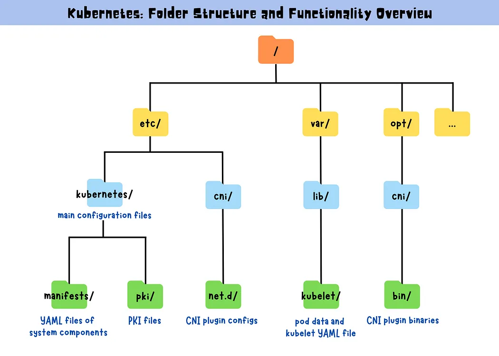

### 개요

이 문서는  **Kubernetes 주요 디렉터리 구조**와 클러스터 사용을 마친 뒤 **리소스를 정리하는 방법**을 설명합니다.  
만약 클라우드 환경에서 VM을 사용했다면, 더 이상 필요 없는 리소스를 해제해 비용 낭비를 방지할 수 있습니다.

---

### 1. Kubernetes 디렉터리 구조

일반적인 Kubernetes 환경에서 자주 보게 될 **주요 디렉터리**와 기능은 다음과 같습니다(설치 방식에 따라 구조는 일부 상이할 수 있음).



```
/etc/kubernetes/
├── manifests/                       # 시스템 컴포넌트를 Pod로 실행하기 위한 YAML
│   ├── etcd.yaml
│   ├── kube-apiserver.yaml
│   ├── kube-controller-manager.yaml
│   ├── kube-scheduler.yaml
│   ├── kube-proxy.yaml
│   └── ...
├── pki/                             # 클러스터 통신을 위한 인증서/키
│   ├── apiserver.crt
│   ├── apiserver.key
│   ├── ca.crt
│   ├── ca.key
│   └── ...
├── kubelet.conf                     # kubelet 설정 파일
├── controller-manager.conf          # 컨트롤러 매니저 kubeconfig
├── scheduler.conf                   # 스케줄러 kubeconfig
└── admin.conf                       # admin kubeconfig

/etc/cni/net.d/                      # CNI 플러그인 구성 파일 위치

/var/lib/kubelet/
├── pods/                            # Pod 데이터 및 볼륨
├── pki/                             # kubelet용 인증서/키
├── config.yaml                      # kubelet 자체 설정 파일
└── ...

/opt/cni/bin/                        # CNI 플러그인 실행 파일
```

#### 주요 디렉터리 설명

- **`/etc/kubernetes/`**: Kubernetes 컨트롤 플레인 설정 파일이 위치
- **`/etc/kubernetes/manifests/`**: kubelet의 `--pod-manifest-path` 옵션을 통해 여기에 있는 YAML 파일을 자동으로 Pod로 실행(Static Pod)
- **`/etc/kubernetes/pki/`**: API 서버, etcd, kubelet 간 보안 통신에 필요한 인증서/키
- **`/etc/cni/net.d/`**: Calico, Flannel 등 CNI 플러그인의 구성 파일
- **`/var/lib/kubelet/`**: kubelet이 Pod 상태·볼륨 등을 관리하고, kubelet 자체 PKI를 저장
- **`/opt/cni/bin/`**: CNI 플러그인 실행 바이너리 위치

> **팁:** 문제 발생 시 `/var/log/` 등에서 로그 확인 후, 필요한 설정 파일이 올바른 디렉터리에 있는지 점검하면 문제 해결에 큰 도움이 됩니다.

---

### 2. 리소스 정리(Cleaning Up)

1. **배포(Deployment)와 서비스(Service) 삭제**  
   예를 들어, 테스트용 `nginx` 배포와 서비스가 있다면:
   ```bash
   kubectl delete deployment nginx
   kubectl delete svc nginx
   ```
   삭제 후에는 정상적으로 사라졌는지 확인:
   ```bash
   kubectl get pods,svc
   ```

2. **시크릿(Secret) 삭제**  
   테스트용으로 생성한 시크릿이 있다면:
   ```bash
   kubectl delete secret kubernetes-the-hard-way
   ```

3. **(선택) 워커/컨트롤 플레인 종료**
    - VM 환경: 더 이상 사용하지 않는다면 인스턴스를 중지·삭제
    - 베어메탈 또는 로컬 환경: systemd 서비스 정지
      ```bash
      systemctl stop kube-apiserver kube-controller-manager kube-scheduler kubelet kube-proxy containerd etcd
      systemctl disable kube-apiserver kube-controller-manager kube-scheduler kubelet kube-proxy containerd etcd
      ```
      이후 설정 파일 등을 완전히 삭제하여 초기 상태로 되돌릴 수 있습니다.

4. **(선택) 로컬 파일 정리**  
   jumpbox나 로컬 머신에 다운받은 바이너리, 설정 파일 등을 삭제:
   ```bash
   rm -rf kubernetes-the-hard-way
   rm -rf ~/.kube/config
   ```
   (필요 없다고 판단되는 자료만 제거하세요.)

> **경고:** 이미 동작 중인 클러스터를 완전히 중단하므로, 데이터가 필요한 경우 주의가 필요합니다.

---


### 결론

- 클러스터 자원을 **정리**해 더 이상 필요 없는 배포나 VM을 제거할 수 있습니다.
- **Kubernetes 디렉터리 구조**를 숙지하면 배포·운영·디버깅 시 큰 도움이 됩니다.
- 이 튜토리얼을 통해 싱글 컨트롤 플레인 환경에서 Kubernetes를 올리는 전 과정을 배웠으니, 이제 고가용성(HA)나 클라우드 연동 등 심화 주제를 탐색해 보세요.

**End of Tutorial**  
이상으로 **Kubernetes the Hard Way** (단일 컨트롤 플레인 버전) 튜토리얼을 마칩니다. 본 자료가 향후 더 다양한 실습과 실전 운영 환경에 도움이 되기를 바랍니다.


