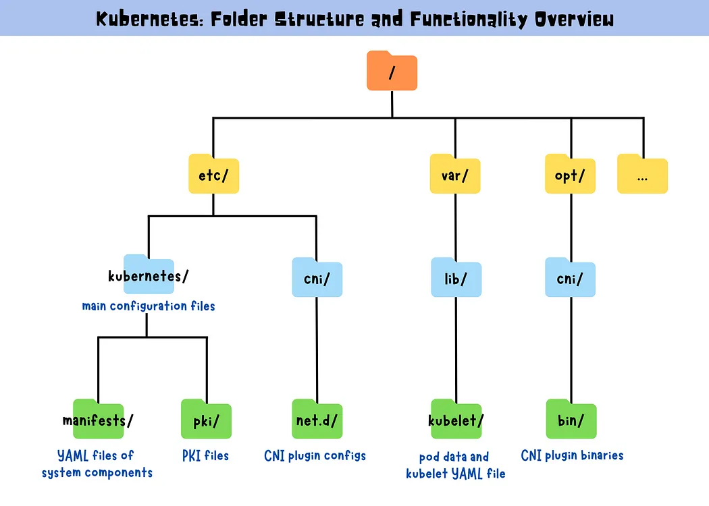

> Kubernetes directory structure includes /etc/kubernetes/ for main configuration files, /etc/kubernetes/manifests/ for YAML files of system components, /etc/kubernetes/pki for PKI files, /etc/cni/net.d/ for CNI plugin configs, /var/lib/kubelet/ for pod data and YAML file of kubelet, and /opt/cni/bin/ for CNI plugin binaries.




Kubernetes: Folder Structure and Functionality Overview

Here’s an overview of the folder structure of a Kubernetes cluster and its functionality:

```
/etc/kubernetes/
├── manifests/                       # YAML files defining Kubernetes resources
│   ├── etcd.yaml                    # etcd cluster manifest
│   ├── kube-apiserver.yaml          # kube-apiserver manifest
│   ├── kube-controller-manager.yaml # kube-controller-manager manifest
│   ├── kube-scheduler.yaml          # kube-scheduler manifest
│   ├── kube-proxy.yaml              # kube-proxy manifest
│   └── ...
├── pki/                             # Public Key Infrastructure for Kubernetes
│   ├── apiserver.crt                # Kubernetes API Server certificate
│   ├── apiserver.key                # Kubernetes API Server private key
│   ├── ca.crt                       # Cluster Certificate Authority certificate
│   ├── ca.key                       # Cluster Certificate Authority private key
│   └── ...
├── kubelet.conf                     # kubelet configuration file
├── controller-manager.conf          # kube-controller-manager configuration file
├── scheduler.conf                   # kube-scheduler configuration file
└── admin.conf                       # kubeconfig file for cluster administrator

/etc/cni/net.d/                      # Folder containing CNI configuration files

/var/lib/kubelet/
├── pods/                            # Directory containing pod volumes and data
├── pki/                             # Public Key Infrastructure for kubelet
├── config.yaml                      # kubelet manifest
└── ...

/opt/cni/bin/                        # Container Networking Interface (CNI) binaries
```

* /etc/kubernetes/: This folder contains the main configuration files for the Kubernetes control plane components.
* /etc/kubernetes/manifests/: This folder contains the YAML files for the Kubernetes system components that run as pods.
* /etc/kubernetes/pki/: This folder contains the public key infrastructure (PKI) files that are used for secure communication between the different components of the Kubernetes cluster.
* /etc/cni/net.d/: This folder contains the configuration files for Container Networking Interface (CNI) plugins used by Kubernetes to manage networking.
* /var/lib/kubelet/: This folder contains the actual data and volumes associated with each pod, as well as the config.yaml file for the kubelet.
* /opt/cni/bin: This folder contains the binary files for CNI plugins used by Kubernetes.